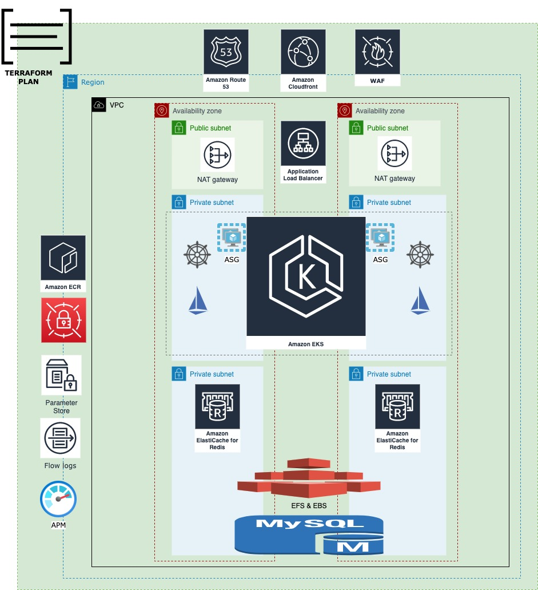

# LMS DIAGRAM & ARQUITECTURE
## DIAGRAM

## ARQUITECURE

1. To create a versioned IaC of all the components with Terraform, "A must" is to have a contingency strategy within another region, containing the same resources.
2. Networking to provise at least 2 Availability zones for the arquitecture(3 recomended as HA Rule and principle). 
3. Route 53 to handle the request trought our diferent landings, it must to have attached the SSL certificates, I recommend to have a single wildcard certificate with 3 sublevels.
4. Cloudfront to handle the static content for faster reponse also reduce the resources usage.
5. WAF for enhance the security and attack mitigations.
6. ALB for to balance the traffic trough our target services
7. EKS Service so the services are distributed into a microservices schema with high availability. 
 I'll choose two types of nodes for the EKS cluster, On Demand and Spot nodes, the ondemand will ensure that we allways count with a starter infrastructure as our Spot nodes will scale horizontally depending what our troughput requires
8. Redis. For caching our Application services containers inside EKS.
9. Volumes. we should define EFS for RWX PV provisioning and EBS for RWO provisioning volumes. StorageClasses aws-ebs and aws-efs. ie. ebs for redis and efs for our microservices.
10. Aurora MySQL DB because the features that comes within. HA, Reliability and Durability, as the most valuable. Then the administration is simplest that RDS, and the failover strategy is predefined as main feature of Aurora.
12. ECR for to storage the versioned images of the microservices.
13. Secret manager and Parameter Store, so we can have separated the sensitive data and the variables respectively
14. Helm for versioning the deployments
15. Istio for Traffic Management and Observability.
